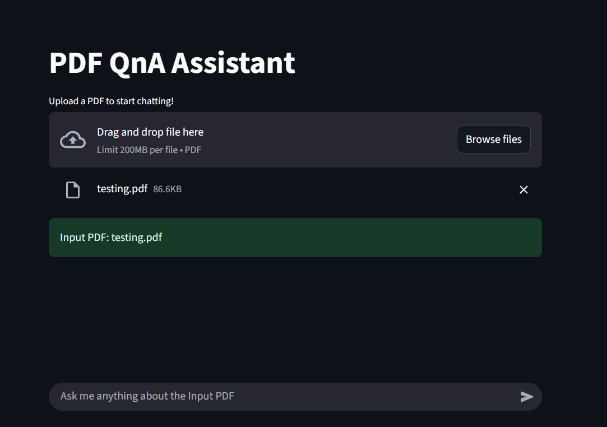

# Simple PDF Chatbot

A simple demonstration of a **PDF Chatbot** that can be run on your local machine. This allows you to chat with PDFs using a Streamlit app.

## Features

* Upload PDFs and ask questions.
* Get quick responses from the text of your uploaded PDFs.
* Works fully on your local machine.

## Installation

### Install UV Package Manager

Install UV by following the instructions here: [https://docs.astral.sh/uv/getting-started/installation/](https://docs.astral.sh/uv/getting-started/installation/)

### Initialize the uv in the folder in which you have cloned the repository

```bash
uv init
```


### Create `.env` File

Add your GROQ\_API\_KEY:

```
GROQ_API_KEY=your_api_key_here
```


### Create a Virtual Environment

```bash
uv venv
```

### Activate the Virtual Environment

On Windows:

```bash
.venv/Scripts/activate
```

On Unix/Mac:

```bash
source .venv/bin/activate
```

### Install Dependencies

```bash
uv add -r requirements.txt
```

### Run the Application

```bash
uv run streamlit run app.py
```

The app will be available at the local host link printed by Streamlit, e.g.: `http://localhost:8501`

## Demo Images

Here are a few sample screenshots:



